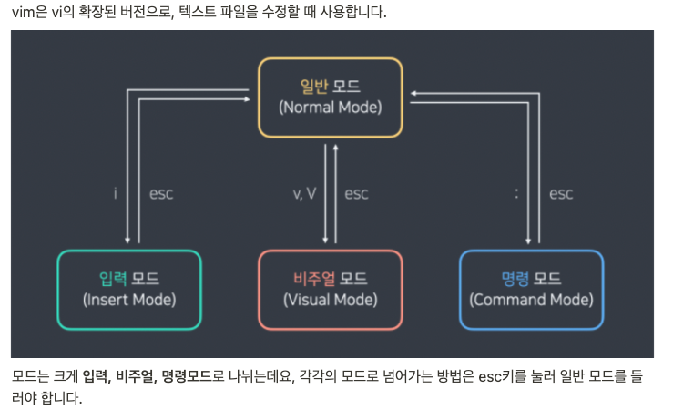

# 서버 스터디 1주차 정리

## 서버란 무엇인가?
- Serve(제공하다) + -er : 서버는 무언가를 **제공**하는 역할
- 서버는 홀알바에 비유할 수 있음
  - 홀알바는 프론트에 상시 대기, 메뉴 숙지가 필요함. 손님과 주방의 매개체.

## 서버의 특징
- 서버 : 클라이언트 = 1 : N 
- 서버와 클라이언트는 상대적인 관계이다. 

## 서버의 구성

- 홀알바 : Web Server(apache, nginx 등)
- 주방장 : Backend Language(php, node.js, spring 등)
- 스마트냉장고 : DBMS(mysql, mongoDB, oracle 등)
 

## 추가학습
### vi 편집기 사용하기
---

**일반적인 사용법**
- i키를 눌러 입력 모드에서 텍스트 수정 작업을 진행한다.
- esc키를 눌러 일반 모드로 전환한다. 
- :키를 눌러 명령 모드로 전환한 후, wq(write & quit)를 치고 엔터를 누르면 저장이 완료됩니다.  
 

### 리눅스 명령어 모음
---
1. cd(Change Directory) : 경로를 이동할 때 사용
- cd '경로' : 특정 경로로 이동함.
- cd .. : 상위 디렉토리로 이동함.
- cd ~ : 루트 디렉토리로 이동함.
 

2. ls(List Segments) : 현재 위치의 파일 목록을 조회
- ls -a: 숨어있는 파일들도 표시함.
- ls -l: 파일의 상세정보를 표시함.
- ls -t: 파일을 생성된 시간별로 표시함.
 

3. touch : 파일의 용량이 0인 파일을 생성하거나, 날짜를 변경
- touch 파일명: 파일명을 생성함.
- touch -c 파일명: 파일명의 시간을 현재시간으로 변경함.
 

4. mkdir(Make Directory) : 새로운 디렉토리를 만들 때 사용
- mkdir dirname: dirname의 디렉토리를 생성한다.
- mkdir -p dirname/subname: 존재하지 않는 디렉토리의 하위 디렉토리까지 생성한다.
 

