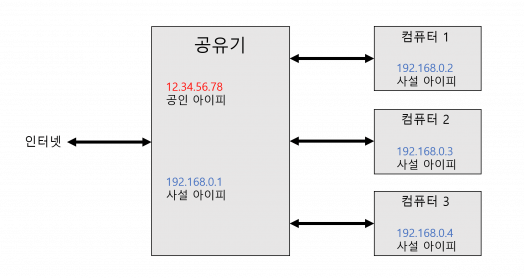
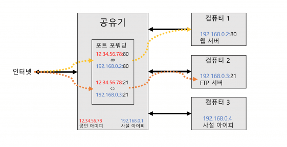

# 서버 스터디 2주차 정리

## Protocol이란?
컴퓨터나 원거리 통신 장비 사이에서 데이터를 주고 받는 양식과 규칙의 체계. **통신 규약이자 약속**
- **http**(HyperText Transfer Protocol) : 인터넷상에서 데이터를 주고 받기 위한 서버/클라이언트 모델을 따르는 프로토콜
- **https** : HTTP에 보안성 기능을 추가한 것. 우리는 HTTP에 ssl 적용을 하여 HTTPS 통신을 해야한다!
- mysql
- ssh
- ftp(File Transfer Protocol)
- sftp
<br/>

## Domain, IP, Port
- 목적지 도로명 주소 : Domain (www.naver.com)
- 목적지 위, 경도 : IP (223.130.200.104)
- 목적지 출입구 : Port 
  - http : 80
  - https : 443
  - ssh : 22
  - ftp : 21
  - sftp : 22
  - mysql : 3306
  - Protocol별 Port 번호는 관례이며, 절대적인 것은 아님. 
  - 서버에 접속할때 IP:Port를 명시해야 하지만, 웹브라우저에서 자동으로 Port를 설정해주기 때문에 할 필요가 없음. (223.130.200.104:80 이나 Port 번호를 붙이지 않은 경우 둘 다 같은 화면으로 이동)
<br/>

## Port Forwarding(포트 전달) 
- 공유기는 공유기에 연결되는 모든 기기들에 사설 네트워크를 구축해준다. 모든 기기들은 사설 IP(내부 IP)를 할당받는다.  
- 또한, 사설 네트워크를 만들면서 동시에 공인 IP(외부 IP)를 하나 할당받는다. 
- 따라서, 공유기에 연결된 모든 장비는 인터넷에 접근하기 위해서는 반드시 공유기를 거쳐야 한다. 

<br/>

- 컴퓨터 1의 웹서버를 80번 포트로 열었다고 생각해보자. 
- 다른 사람들이 인터넷을 통해 컴퓨터 1의 웹서버에 접근하가 위해 공유기가 보유한 **공인 IP:80** 을 통해 접근하려고 한다. 연결이 될까?
- NO. 공인 IP의 80번 포트로 들어오는 연결은 공유기에 도달하면 끝나버린다. 
- 왜냐하면 공인 IP로 들어온 80번 포트로의 연결을 컴퓨터 1,2,3 중 어떤 곳으로 보내줘야할지 정해져있지 않기 때문이다.
- 따라서, 공인 IP로 들어오는 80번 포트의 연결을 컴퓨터 1의 80번 포트로 연결하라고 공유기에 설정을 해야한다. 이를 ```포트포워딩```이라고 한다.

<br/>

- 주요 참고사항 
  - 외부에서 접속하는 포트와 내부에서 연결하는 포트는 서로 다를 수 있다. (80을 8080으로 포워딩 가능)
  - 내부에서 연결하려는 포트는, 연결하고자 하는 장비의 아이피를 반드시 지정해야 한다. 
  - 하나의 포트로 들어오는 연결을 두 아이피로 포워딩 할 수 없다. (하나의 포트는 하나의 포워딩만 가능)
  - 포워딩하고자 하는 아이피는 반드시 공유기가 할당한 사설 아이피여야만 한다.
<br/>

## AWS
<br/>


## 추가학습
### HTTP 알아보기

**HTTP Packet**
- HTTP 프로토콜을 통해 네트워크 상에 주고 받는 데이터 블록
- 크게 **Header**와 **Body**로 나뉜다. 
  - Header
    - 데이터 이외에 HTTP 선두에 삽입되는 부분
    - 목적에 따라 응답/요청 헤더로 나뉜다. 
  - Body 
    - Payload라고도 부름
    - Html 텍스트 외에 이미지 등과 같은 이진데이터도 담을 수 있음. 
