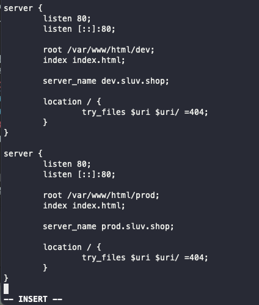
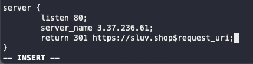

# 서버 스터디 3주차 정리

## 실습 요약
- ec2 ubuntu 인스턴스에 nginx, php, mysql 설치하기
  - ```sudo apt update``` (설치 가능한 패키지 리스트 최신화하기)
  - ```sudo apt install nginx``` (nginx 설치하기)
  - ```sudo apt install mysql-server``` (mysql 설치하기)
  - ```sudo mysql_secure_installation``` (mysql 보안 설정하기)
  - ```sudo mysql -u root -p``` (mysql 로그인하기)
  - ```sudo apt install php-fpm php-mysql``` (php 설치하기)
<br/>

- phpinfo 화면 띄우기 (nginx와 php 연동하기)
  - ubuntu의 nginx 루트 경로로 이동하기 : ```cd /var/www/html```
  - phpinfo.php 파일 만들기 : ```sudo vi phpinfo.php```
  - nginx 가상서버 환경설정 디렉토리로 이동 : ```cd /etc/nginx/sites-available```
  - default 파일 열기 : ```sudo vi default```
  - **location ~ \.php$ 블록** 그리고 그 안의 **include문**과 **fastcgi_pass문** 주석 해제하기
    - fastcgi_pass문의 경우, php 버전을 본인이 설치한 버전과 동일하도록 수정하기
  - nginx 설정 파일 열기 : ```cd /etc/nginx``` & ```sudo vi nginx.conf```
  - **server_names_hash_bucket_size 64;** 부분 주석 해제하기
  - nginx 테스트하기 : ```sudo nginx -t```
    - nginx 설정파일을 수정하면, 반드시 테스트 후 재시작을 해주어야한다. 
  - nginx 재시작하기 : ```sudo service nginx restart```
  - IP주소/phpinfo.php로 이동하면, phpinfo 화면이 뜨는 것을 확인할 수 있다. 
<br/> 

- Domain 적용하기
  - 가비아에서 도메인 구입
  - DNS 레코드 추가하기
    - 타입은 **A**
    - 호스트는 **@, www**
    - 값/위치는 **IP 주소**
    - TTL은 **3600**
  - nginx 가상서버 환경설정 디렉토리로 이동 : ```cd /etc/nginx/sites-available```
  - default 파일 열기 : ```sudo vi default```
  - server_name에 연결할 도메인 주소 작성하기
  - nginx 테스트 & 재시작하기
<br/> 

- Sub Domain 적용하기 (Dev, Prod)
  - DNS 레코드 추가하기
    - 타입은 **CNAME**
    - 호스트는 **dev, prod**
    - 값/위치는 **도메인 주소** (가장 마지막에 . 찍어주기)
    - TTL은 **3600**
  - ubuntu의 nginx 루트 경로로 이동하기 : ```cd /var/www/html```
  - dev와 prod 폴더 만들어주기 : ```sudo mkdir dev prod``` 
  - dev와 prod 폴더에 각각 띄워줄 index.html 만들어주기 : ```sudo vi index.html```
  - nginx 가상서버 환경설정 디렉토리로 이동 : ```cd /etc/nginx/sites-available```
  - default 파일 열기 : ```sudo vi default```
  - dev & prod 서버블록 각각 작성하기
  
  - nginx 테스트 & 재시작하기
<br/>

- HTTPS를 도메인과 서브 도메인에 적용하기
  - [참고자료](https://luminitworld.tistory.com/85)

- Redirection 적용하기
  - nginx 가상서버 환경설정 디렉토리로 이동 : ```cd /etc/nginx/sites-available```
  - default 파일 열기 : ```sudo vi default```
  
  - nginx 테스트 & 재시작하기
