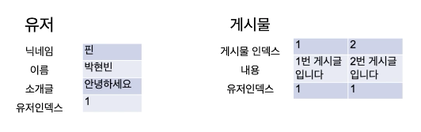
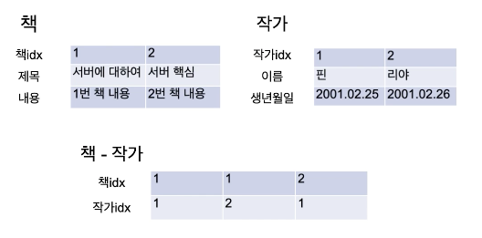

# 서버 스터디 4주차 정리

## Database 이론 정리

### RDB(Relational Database), RDBMS(Relational Database Management System)
- RDB는 ```관계형 데이터 모델```에 기초를 둔 데이터베이스
  - 모든 데이터를 2차원 테이블 형태로 표현
  - 데이터의 상관관계 중 개체간의 관계를 표현한 것
- RDBMS는 관계형 데이터베이스를 생성, 수정, 관리할 수 있는 소프트웨어
  

### Database 용어
- 테이블(Table)
  

### SQL(Structured Query Language)
- RDBMS에서 데이터를 관리 및 처리하기 위해 설계된 언어
  
- DDL(Data Definition Language, 데이터 정의 언어) 
  - 데이터를 담는 그릇을 정의하는 언어
  - **테이블을 정의**하기 위해 사용하는 언어
    - CREATE TABLE
    - ALTER TABLE
    - DROP TABLE
    - TRUNCATE TABLE
  
- DML(Data Manipulation Language, 데이터 조작 언어)
  - 데이터베이스에 입력된 레코드를 **조회, 추가, 수정, 삭제**하는 등의 역할을 하는 언어
    - SELECT
    - INSERT
    - UPDATE
    - DELETE
  
- DCL(Data Control Language, 데이터 제어 언어)
  - 데이터베이스에 접근하거나, 객체에 권한을 주는 등의 역할을 하는 언어
    - GRANT
    - REVOKE  

  

## 인스타그램 DB 설계 실습
- 1단계 : 시스템 분석
  - 어떤 데이터가 필요할지 분석하여 나열하기
  
- 2단계 : 논리
  - Entity(객체) : ex. User 객체   
  - Attribute(속성) : ex. User 객체의 Attribute
    - User 아이디
    - User 이름
    - User 프로필 사진
    - User 웹사이트 링크
    - User 소개글
    
  - Relation(관계)
    - 1:1
    - 1:N
      - User 1명이 N개의 게시글을 작성할 수 있다!
      - 하지만, 1개의 게시글을 User N명이 작성할 수는 없다! 
      - 따라서, User : 게시글 = 1 : N
    - N:M

- 3단계 : 물리
  - Entity => Table
  - Attribute => Table의 Column
  - Relation => PK, FK, join
    - PK : index
    - FK 
      - 1:N : 1에 속하는 Table의 index를 N에 속하는 Table에 추가해주기
      

      - N:M : 따로 index Table을 만들어주기
      